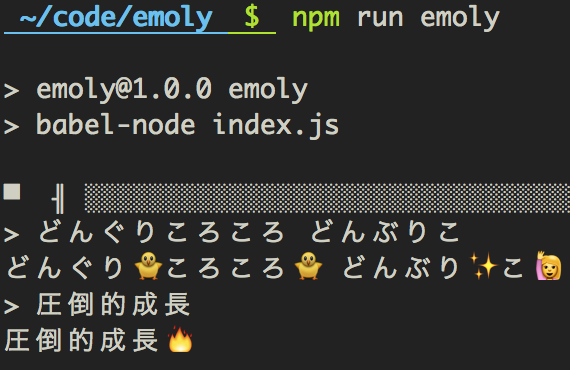

# emoly

`emoji + lyrics`

## WIP: Installation

```
$ git clone https://github.com/kvvzr/emoly.git
$ cd emoly
$ npm install
# word2vecのmodelを作って、index.jsのmodelPathをいい感じに変更
```

## WIP: Usage

```
$ npm run emoly
# word2vecモデルのロードに少し時間が掛かる
```



まだemojiのデータを揃えていなかったり、色々未調整のままなのであまり良くない
